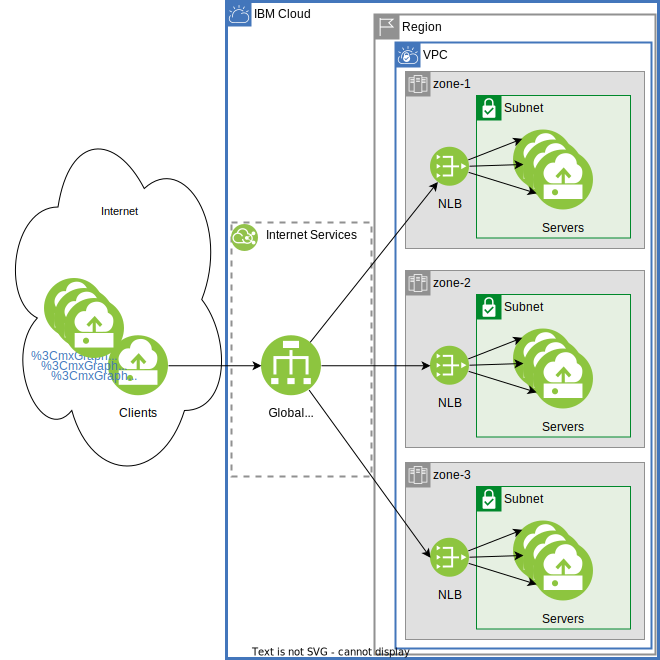

# Regional load balancer accessable through CIS GLB

Connect an IBM Cloud Internet Services, CIS, Global Load Balancer, GLB to an application that is load balanced using a Virtual Private Cloud, VPC, Network Load Balancer, NLB.  The NLB back end can be Virtual Server Instances, VSIs, or IBM Kubernetes Services, IKS.

VPC, VSI, NLB, CIS:



VPC IBM Kubernetes Service, IKS, cluster:


NOTE the implementations below are for demonstration purposes.  Production environmens should be adjusted to meet security and production requirements.

You can provision from your laptop by running terraform, or using IBM Cloud Schematics

## Terraform Provision from laptop

### Configure

See [terraform](https://cloud.ibm.com/docs/solution-tutorials?topic=solution-tutorials-tutorials#getting-started-macos_terraform) getting started instructions.


```
cp template.local.env local.env
vi local.env;# make the required changes
source local.env
```

### VPC, VSI, NLB, CIS Configuration

To create the VPC, subnets, NLB, Instances, and CIS GLB change to the vpc_nlb_tf directory and do execute terraform:

```
cd vpc_nlb_tf
terraform init
terraform apply
```

The output will provide some test curl commands for the CIS GLB and the VPC NLBs.  Try these out to verify your results.


### IKS, NLB, CIS Configuration
To create the IKS cluster, Deployments and Services (with VPC NLBs) use the iks_tf directory.

```
cd iks_tf
terraform init
terraform apply
```

It can take over an 60 minutes for the IKS cluster to be created and over 10 minutes for the Kubernetes Service with associated VPC NLBs to be created.

NOTE SECURITY ALERT: Once complete a directory with a name ID_admin_k8sconfig, like 0123456789ec701234567899cf70204f61cbbe0123456789c078ec0c2c552a1c_ce4n8jsd0lnv9j97v45g_admin_k8sconfig, will be created and it has the credentials to access the kubernetes cluster.

The ID_admin_k8sconfig/config.yaml file can be used to inspect the kubernetes resources: `export KUBECONFIG=0123456789ec701234567899cf70204f61cbbe0123456789c078ec0c2c552a1c_ce4n8jsd0lnv9j97v45g_admin_k8sconfig/config.yml` The terraform output has this string ready to copy/paste.

The terraform output will provide some test curl commands for the CIS GLB and the VPC NLBs.  Try these out to verify your results.  The NLBs should return servers from the associated zone.  The GLB will return a mix of zones.

The terraform output will also have commands to copy/paste to configure the environment to run `kubectl` kubernetes commands.

### Clean Up

In either the vpc_nlb_tf/ iks_tf/ directories you can destroy all of the resources:

```
terraform destroy
```

## Schematics
Create a new [IBM Schematics Workspace](https://cloud.ibm.com/schematics/workspaces):
- GitHub repository URL: https://github.com/IBM-Cloud/vpc-cisglb-nlb/tree/master/vpc_nlb_tf
- Terraform version: terraform_v1.2
- Fill in the rest to meet your requirements


For IKS use the GitHub repository URL: https://github.com/IBM-Cloud/vpc-cisglb-nlb/tree/master/iks_tf
